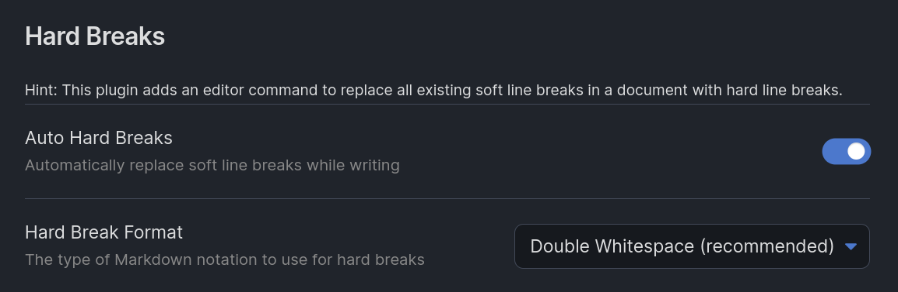

# Obsidian Hard Breaks Plugin <!-- omit in toc -->

A plugin for [Obsidian](https://obsidian.md/) that adds an editor command to force [*hard* line breaks](https://spec.commonmark.org/0.17/#hard-line-breaks) (in contrast to [*soft* line breaks](https://spec.commonmark.org/0.17/#soft-line-breaks)) in the currently opened document. Hard line breaks are forced **only in paragraphs of text and blockquotes**! The plugin will not touch text in tables, links, lists, etc.

Obsidian Hard Breaks Plugin makes use of [a set of robust Open-Source Markown parsing tools](#acknowledgements) to guarantee it does what it's supposed to do.

- [Features](#features)
- [Do I need this plugin?](#do-i-need-this-plugin)
- [What are soft vs. hard line breaks?](#what-are-soft-vs-hard-line-breaks)
- [Why force hard line breaks?](#why-force-hard-line-breaks)
- [Installation](#installation)
- [Thoughts on possible additional features](#thoughts-on-possible-additional-features)
  - [Automatic hard breaks while writing](#automatic-hard-breaks-while-writing)
  - [Force line breaks in multiple documents](#force-line-breaks-in-multiple-documents)
- [Development](#development)
- [Acknowledgements](#acknowledgements)


## Features

This plugin gives you ...

1) ... an editor command that replaces all line breaks in the current document with *hard* line breaks (**only in paragraphs of text and blockquotes**, never in code blocks, front matter, etc.).
2) ... an option in the settings to choose the format for the hard line breaks to use (`  ` or `\`).

> ℹ️ The formats for *hard* line breaks are specified in the [CommonMark specification](https://spec.commonmark.org/0.17/#hard-line-breaks). It allows two whitespaces or a backslash at the end of a line. While the backslash is more visible in the Markdown source, it's less common and somewhat clutters your text. But it's a matter of taste...




## Do I need this plugin?

Maybe. Maybe not. If you already know the [difference between soft and hard line breaks in Markdown](#what-are-soft-vs-hard-line-breaks), jump right to "[Why automatic hard line breaks?](#why-automatic-hard-line-breaks)" to understand the rationale of this plugin.

Long story short: If you...

- ... need actual line breaks inside of paragraphs (e.g. for writing Poems...)
- ... never intentionally use *soft* line breaks in Obsidian anyway (because [why should you?](#why-automatic-hard-line-breaks))
- ... don't want to type *hard* line breaks manually when you need them but still want portable Markdown documents

..., you might like this.

If you, for some reason, use *soft* line breaks (that only exist in editing, never in "Reading" mode or any other parsed and rendered version like HTML) a lot, this plugin may not be for you.


## What are soft vs. hard line breaks?

In Markdown, a simple line break in the Markdown source is considered a [*soft line break*](https://spec.commonmark.org/0.17/#soft-line-breaks). When parsing the Markdown to HTML, it will be parsed as a whitespace character or, again, a normal line break (which makes no difference in HTML). See this example:

```md
foo
bar
```

... will be parsed to one of these (which are the same, because any spaces in HTML will be rendered as one single whitespace):

```html
<p>foo bar</p>

<p>foo
bar</p>
```

For a common text flow with paragraphs, this is fine. But sometimes you need a line break without breaking the whole paragraph. This is what [*hard line breaks*](https://spec.commonmark.org/0.17/#hard-line-breaks) are for. In Markdown, *hard* line breaks are line breaks that are preceded by two whitespace characters (`  `). See this example (select the text to see the whitespaces):

```md
foo  
bar
```

This will be parsed to:

```html
<p>foo<br/>bar</p>
```

... with an *actual* line break.


## Why force hard line breaks?

Why should one use *soft* line breaks at all? They don't make any difference in how the document is parsed/rendered. There is only one reason to use them (prove me wrong!): Manually wrapping paragraphs in Markdown source text. This *might* be desirable in an environment where long lines in the text flow aren't wrapped automatically (e.g. in a shell) or where the editor is so wide that the long lines become hard to read.

But Obsidian is **not** such an environment. It wraps text. The editor has a nice, reduced width. **There is no need for soft line breaks in Obsidian.**

Obsidian has a setting called "Strict line breaks". If you turn it off, Obsidian stops distinguishing *soft* and *hard* line breaks in "Reading" mode and displays anything as a *hard* line break. That's a nice feature for its convenience, but it's also a false view on your document as it doesn't follow the Markdown specification. Try giving the Haiku you wrote in Obsidian *without* using *hard* line breaks ...

```md
An ancient pond!
With a sound from the water
Of the frog as it plunges in.
```

... to a friend who uses a software that strictly obeys the [CommonMark specification](https://spec.commonmark.org). Your Haiku will look like this:

> An ancient pond! With a sound from the water Of the frog as it plunges in.

You need hard line breaks in yout text to write actual Markdown in such cases. If you want a line break inside of a paragraph in Markdown, you have to use a *hard* line break. Otherwise your document isn't really portable to other Markdown platforms. But having to type two whitespaces  (or a backslash) at the end of a line just to get a line break isn't ideal. Especially if you *never need soft line breaks* in flowing text anyway.


## Installation

There are two ways:

- Using [Obsidians community plugin browser](https://obsidian.md/plugins?id=hard-breaks) (recommended!)
- Installing the plugin manually (why though?): Unpack the downloaded archive file into Obsidians plugin directory. Warning: You won't get automatic updates this way!


## Thoughts on possible additional features

### Automatic hard breaks while writing

The very first version of this plugin had a feature to automatically replace soft line breaks with hard line breaks while writing in the editor. This feature, although it was a nice idea, was removed due to the following reasons:

- While writing, it's impossible to detect whether you are inside of a paragraph or an unfinished (non-closed) code block, front matter block or the like.
- The Obsidian API doesn't offer the events needed to safely automate this operation: Editor changes won't work (see previous point), file changes won't work (Obsidian saves the file periodically, so this would change the document "under your fingers" while writing). Hopefully, this will change in the future. Would be nice to have!

### Force line breaks in multiple documents

Another command that lets you force hard breaks not only in the current document, but in a selectable set of documents (a whole folder, the entire vault, etc.). This might very well be added in the future. 


## Development

First, install the dependencies with

```bash
npm i
```

Then, you can compile the plugin with:

```bash
npm run build
```

This will create a `main.js` file in the project root, which is the entry point of the plugin.

For testing it, the `main.js` and the `manifest.json` have to be placed in a `.obsidian/plugins/hard-breaks/` folder (within your vault) to be picked up by Obsidian on the next start.


## Acknowledgements

This plugin is based on the following projects:

- [remark](https://github.com/remarkjs/remark)
- [unified](https://github.com/unifiedjs/unified)
- [unist-util-select](https://github.com/syntax-tree/unist-util-select)
- [remark-gfm](https://github.com/remarkjs/remark-gfm)
- [remark-frontmatter](https://github.com/remarkjs/remark-frontmatter)

Also, thanks to [THeK3nger](https://github.com/THeK3nger) for the nice [Obsidian plugin project template](https://github.com/THeK3nger/obsidian-plugin-template). It made things easier.
